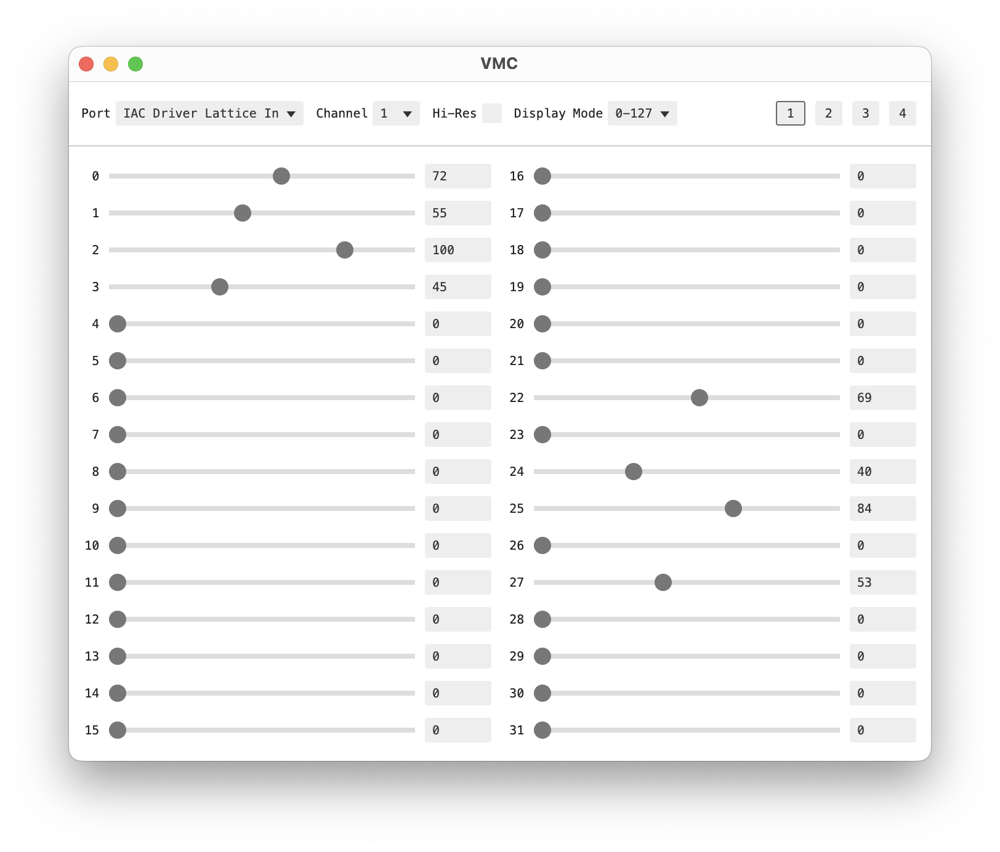

# Virtual MIDI Controller (VMC)

An Electron desktop app I whipped up to aid in local development. Sends CCs to
any MIDI output on your system.

- Ability to select output port
- Set channel
- Toggle between regular or high-resolution CCs for CCs for 0-31 (inclusive)
- Adapts to your systems Dark/Light theme preferences
- TODO: different range display modes (float, percentage, etc)

# Status

The app is working locally as well as when built on a Mac. It is not quite at v1
in my opinion but is good enough.
